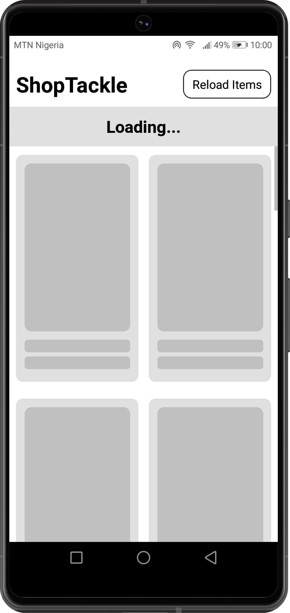
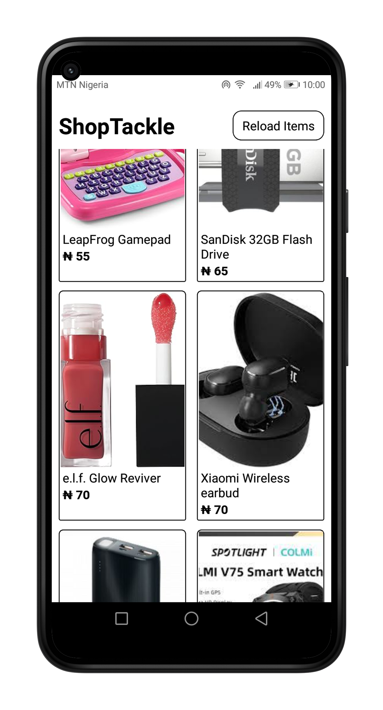
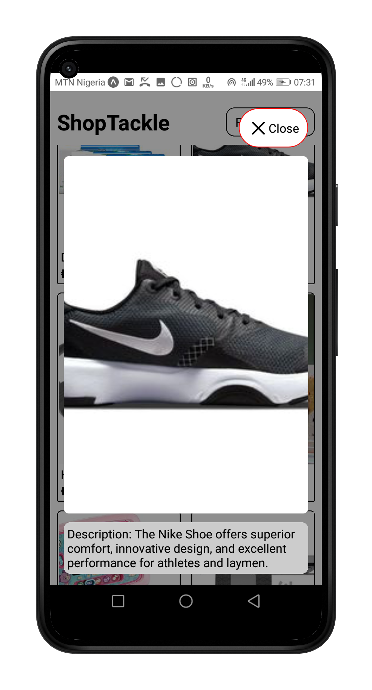
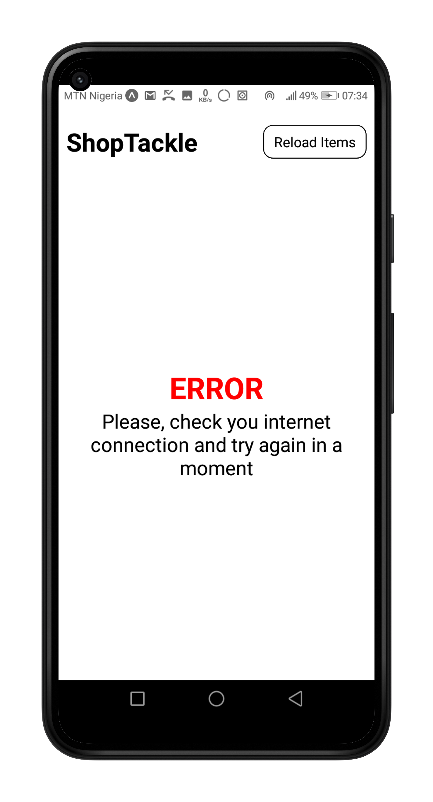
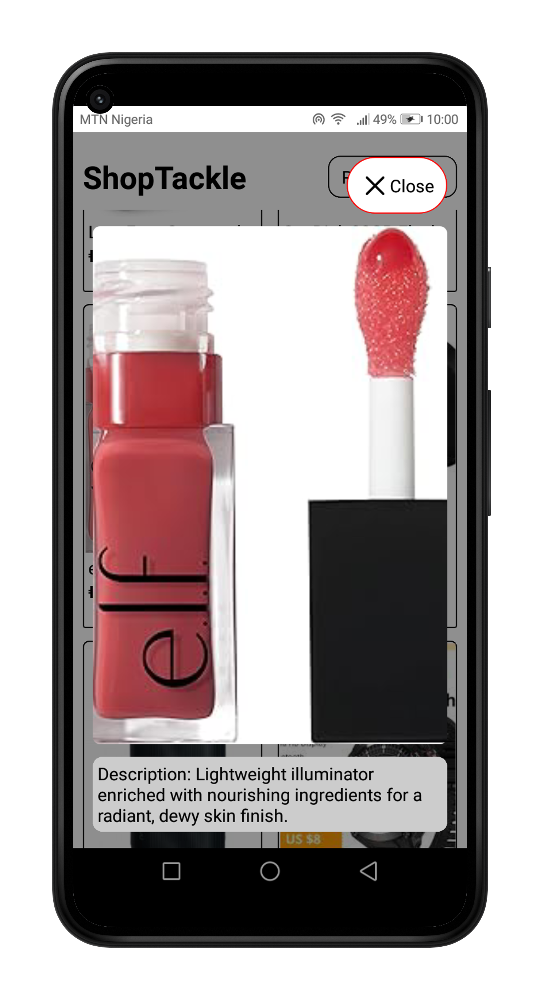

# SHOPTACKLE - A Simple Shopping App
This is a project built with react native expo with absolutely zero dependencies

## Features


- **Products Screen:** Fetch and displays a list of products/items from timbu api.
- **Products Modal:** Displays advanced information about selected product from timbu api.

## Tech Stack
- ### Dependencies: Absolutely none
- **Framework:** Built using Expo and React Native.
- **Platform:** Cross-platform app compatible with iOS and Android.

## Appetize.io Demo:

Access the demonstration of the **shopTackle** app on Appetize.io:
- [Appetize.io Demo Link](https://appetize.io/app/b_47jfxerczn3cqltmcc34lz6o44)

## App download link:
- [App Download Link](https://expo.dev/artifacts/eas/wdabUJAkkpgVZPJmjjpWyx.apk)

## Setup Instructions:
### Clone Repository:
```bash
   git clone https://github.com/monyasau/shopTackleTimbu.git
   cd shopTackleTimbu
```
### Install Dependencies:
```npm install```

### Run the App:
```npx expo start```

## Screenshots:




